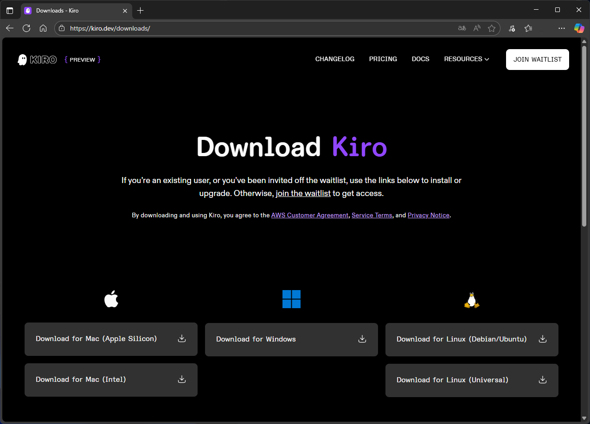
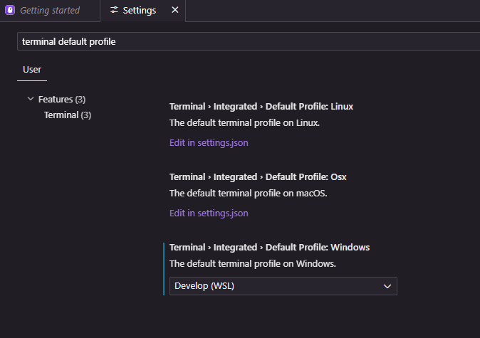
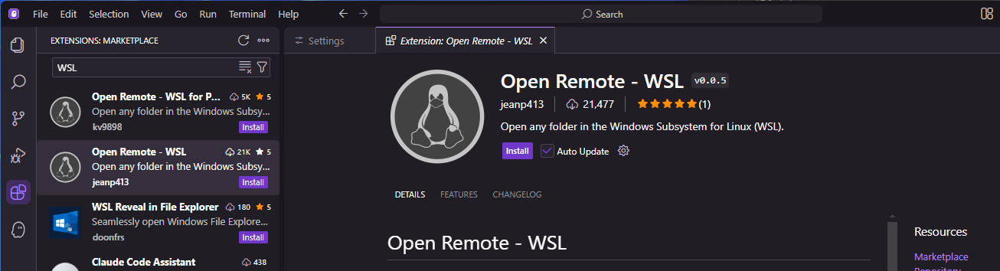
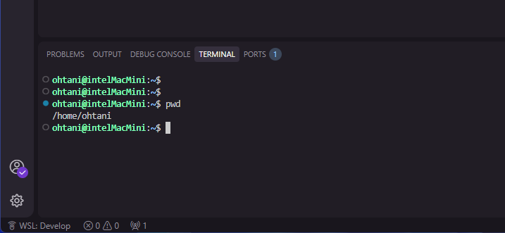

# WSL2上で初めてのKiro

WSL2上で使うには最初にちょっとした準備をして進める方がいいのでその手順について残しておく。

というのもの、Windows上にファイルがあっても開発することは可能だが、PowerShell経由だとコマンド起動が遅いのと、`/mnt/...`のようにWindows側のファイルシステムを使うことでもパフォーマンスが落ちるので、直接WSL2上でコマンド起動することと、ファイル操作もLinuxファイルシステムを直接使えるようにする手順となる。

これらを準備していないことで起こる最大の問題は、コマンド実行時、特に比較的時間のかかるテスト実行で実行の完了をKiroがうまく検出できず待てないことがある。AgenticAIの利便性を享受するためにもこの準備は整えた上で進めたい。

_Created by T.Ohtani at 2025/08/30_

## ダウンロードとインストール

ともかくKiroをダウンロードする。



起動するとアカウント登録を要求される。今回はGoogleアカウントで登録した。

WSL2上で使っていくのだが、Power Shell経由でのコマンド起動は起動プロセスのオーバーヘッドが馬鹿にならないので、可能な限り直接WSL2つまりLinuxファイルシステムを直接使った状態にすることで、パフォーマンス向上を図る。

- デフォルトターミナルのWSL2化

KiroのAgentはターミナルを一つ独立して起動して使うことになるので、AgentがWSL2上で直接実行できるようにしておく必要がある。
その設定は`Terminal > Integrated > Default Profile: Windows`で設定する。複数のディストリビューションをインストールしている場合も対応できる。



- リモート起動

Microsoft謹製のWSL拡張は使えないようなので、次の`Open Remote - WSL`を使わせてもらう。



Windows側のユーザーフォルダの下にある`%USERPROFILE%.kiro\argv.json`ファイルに次の項目を追加する。

```json
{
    ...
    "enable-proposed-api": [
        ...,
        "jeanp413.open-remote-wsl",
    ]
    ...
}
```

Kiroを再起動して左下のリモート接続アイコンからWSL2に接続して起動する。場合によってはアカウントの再認証になることがある。




