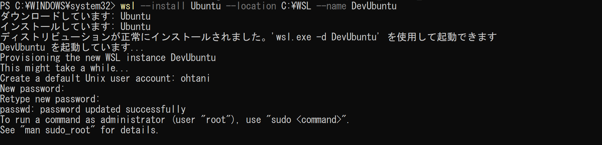
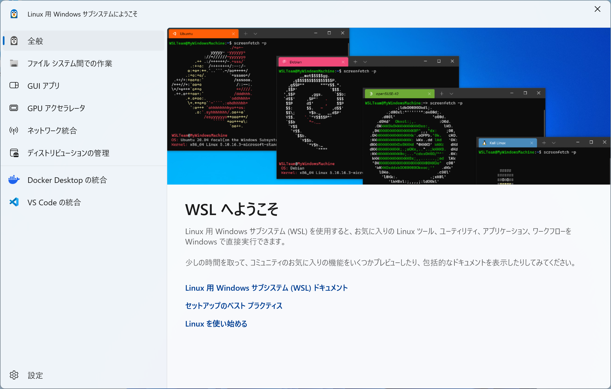

# オレオレWSL2

コンテンツそのものはGit等にリモート保存するので作業用ディスクとしている`D:`ドライブ等にディストリビューションを保存することで`C:`ドライブの空きを確保しておくようなオレオレな使い方の手順を示す。

前処理として、WSL2を使えるようにするには、ホストマシンの仮想アプリケーションを使えるようにしておく必要がある。超ニッチ？なオレオレ環境は、VMWare上のWindowsがホストマシンになるので、VMWare仮想マシンのプロセッサ設定で「この仮想マシンでハイパーバイザーアプリケーションを有効にする」にチェックを入れておく。


まず、WSL2のコンポーネントをインストールする。ディストリビューションは後から手動で入れる。

```ps
# 必要なオプション コンポーネントのみをインストール
wsl --install --no-distribution
```

- ディストリビューション名
- インストール先

```ps
# インストールパスのフォルダを準備（例えばD:ドライブに置く場合に使う）
mkdir C:¥WSL

# インストールパス及びディストリビューション名を指定してUbuntuをインストール
wsl --install Ubuntu --location C:¥WSL --name DevUbuntu
```



- WSLアプリを起動したところ



