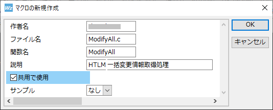

# はじめに

テキストエディタの「マクロ」という機能、聞いたことはあるけど、実際に使い始めるには少しハードルが高いように感じたことはありませんか？私もその一人でした。しかし、ある時、大量のHTMLファイルに対して同じ処理を繰り返す作業が発生し、その時に「これは手作業では無理だ」と実感しました。そこで[Wz Editor 10](https://www.wzsoft.jp/wz10/)のマクロ機能に挑戦することにしたのです。

最初は設定の方法や仕組みが複雑で、何度も試行錯誤を繰り返しましたが、少しずつ慣れてくると、効率化の効果は絶大でした。この記事では、私が実際に体験したマクロの導入プロセスや、どうやってマクロを使って効率化を図ったのかを、具体的な例を交えながらご紹介します。これを読めば、あなたもマクロを使って作業を自動化する第一歩を踏み出せるはずです！

# Wz Editor 10のマクロとは？

マクロとは、一言で言うと「一連の操作を自動化するためのスクリプト」です。特定の手作業を何度も繰り返す代わりに、マクロを使えば、あらかじめ設定した処理を自動的に実行してくれます。Wz Editor 10には、このマクロ機能が備わっており、繰り返し作業や面倒なテキスト処理を驚くほど簡単に自動化できます。

たとえば、ディレクトリ内の複数のファイルを一括で処理する場合、通常であれば1つ1つのファイルを手作業で編集する必要があります。しかし、Wz Editor 10のマクロを使うことで、その一連の作業を自動的に処理することが可能になります。私も、大量のHTMLファイルに対して同じ操作を繰り返す必要があったため、この機能を使い始めました。

最初は「マクロ」と聞くと難しそうに思えるかもしれませんが、実際に使い始めるとその便利さに驚くはずです。特にWz Editor 10では、比較的シンプルなコマンドから複雑な自動化まで対応しており、作業効率が大幅に向上します。

# 実際にマクロを使ってみよう

それでは、実際にWz Editor 10でマクロを使って、ディレクトリ内の`index.html`ファイルを一括で処理する方法を見ていきましょう。マクロの魅力は、テキストエディタの持つ強力なテキスト処理機能を活かしながら、繰り返し作業を自動化できる点にあります。具体的な手順を順を追って説明しますので、試しながら進めてみてください。

## マクロの準備
Wz Editor 10のマクロ機能には、キーボード操作を記録する簡易なマクロだけでなく、C言語に似たプログラミング言語「Text-C」を使って、より複雑な処理を自動化することができます。今回は、この「Text-C」を使って外部ファイルを扱うマクロプログラムを作成する方法を紹介します。

まず、マクロプログラムファイルを作成するには、以下の手順を実行してください。

### マクロの新規作成
メニューから「マクロ」→「マクロの新規作成」を選択すると、新規作成のダイアログが表示されます。ここで、以下の項目を入力します。


作者名: 自分の名前やIDを入力します。
ファイル名: マクロプログラムのファイル名を指定します。
関数名: メインとなる関数の名前を設定します。

### マクロプログラムファイルの保存場所
マクロプログラムファイルは、Wz Editorが管理するフォルダ wzcfg://textc に自動的に保存されます。このフォルダは、エディタの設定ファイルやカスタマイズファイルが管理される場所です。

### 基本的なマクロのひな形
新規のマクロを生成する際に「サンプルなし」を指定しても、次のような基本的なひな形が自動的に生成されます。このコードは、開いているエディタのテキストハンドルと画面ハンドルを取得するための最低限のマクロです。

```c
#include <windows.h>
#include <text.h>

ModifyAll {
    title: HTLM一括変更情報取得処理
    HTEXT text = getfocus();
    HVIEW v = text.v;
}
```

このマクロ自体は何も処理を行いませんが、保存後に「マクロ」→「コンパイル」を実行し、次に「マクロ」→「実行」を選択することで、マクロを実行できるようになります。

## ディレクトリ内のHTMLファイルを処理

次に、基準となるフォルダを指定し、ディレクトリ内のHTMLファイルを処理するマクロの作成手順を見ていきましょう。このマクロでは、まず基準となるフォルダを指定し、そのフォルダ内のサブディレクトリを走査して、`index.html`ファイルに対して特定の処理を行います。

### 1. 基準フォルダの指定

最初に、基準となるフォルダを指定します。ユーザーにフォルダ選択ダイアログを表示し、選択されたフォルダのパスを取得します。

```c
txstr szFolder = new();
uiSelectFolder(szFolder, "基準となるフォルダを指定");
```

### 2. ディレクトリを走査し、ファイルを検索

次に、基準フォルダを元に、OSの機能を利用してディレクトリ内のファイルやサブディレクトリを検索します。この部分は、典型的なディレクトリサーチのパターンですが、ファイル名の処理に癖があります。

```c
WIN32_FIND_DATA ffd;  // ファイル情報を格納する構造体
// 基準ディレクトリ内を走査するためのパスに変更する
pathsetdir(szFolder, TRUE);
pathsetfile(szFolder, "*");
// 最初のファイルまたはディレクトリを検索
HANDLE hfind = filefindfirst(szFolder, &ffd);
if (hfind == INVALID_HANDLE_VALUE) {
    iprintf("can not open %s\n", szFolder);
    return;
}
do {
    // ディレクトリのみを対象とする
    if (ffd.dwFileAttributes & FILE_ATTRIBUTE_DIRECTORY) {
        // 現在のディレクトリ（"."）および親ディレクトリ（".."）をスキップ
        if (!ffdisdotdir(&ffd)) {
            // サブディレクトリのフルパスを構築
            txstr htFindFileName = new();
            insertw(htFindFileName, ffd.cFileName);  // 文字列をSJISに変換して挿入
            // 処理対象のディレクトリ名に特徴がある場合の例
            if (txSearchEx(htFindFileName, "^\\w{3}_", SEARCH_ALL|SEARCH_REWZ)) {
                txstr htSubDirName = dup(szFolder);
                pathsetfile(htSubDirName, htFindFileName);
                // ここが本来させたい処理になり、htFindFileNameが対象のディレクト名を保持している
                iprintf("Target File = %s\n", htFindFileName);  // for DEBUG
                procIndexHtml(htSubDirName);  // index.htmlの処理を呼び出す
                delete(htSubDirName);
            } else {
                // パターンに一致しない場合は処理をスキップ
                iprintf("unmatch = %s\n", htFindFileName);
            }
            delete(htFindFileName);
        }
    }
} while (filefindnext(hfind, &ffd));  // 次のファイルまたはディレクトリを検索

// ハンドルを閉じる
filefindclose(hfind);
```

このコードでは、ディレクトリ内のサブディレクトリを走査し、ディレクトリ名が特定のパターンに一致する場合に、そのディレクトリ内の`index.html`ファイルを処理するようにしています。

### 3. `index.html`ファイルを処理

実際の処理は、`procIndexHtml`関数内で行います。この関数では、指定されたディレクトリ内の`index.html`ファイルを開き、その内容を読み込んで特定の処理を施します。

```c
void procIndexHtml(HTEXT htSubDirName) {
    // 受け取ったディレクトリ名に \index.html を付加する
    HTEXT htFileName = dup(htSubDirName);
    pathsetdir(htFileName, TRUE);
    pathsetfile(htFileName, "index.html");
    iprintf("FILE: %s\n", htFileName);  // for DEBUG

    // 対象の index.html をテキストに読み込む
    HTEXT htTemp = new();
    if (load(htTemp, htFileName)) {
        tosjis(htTemp, detectkc(htTemp));  // 文字コードを自動判定し、SJISに変換する
        // TODO: ここで htTemp テキストに対してやりたい処理を施す
    }

    // 後処理
    clear(htTemp);
    delete(htTemp);
    delete(htFileName);
}
```

この処理により、指定された`index.html`ファイルの内容を取得し、必要に応じて文字コードを変換したり、特定の操作を実行できます。

## マクロの保存と実行

最後に、作成したマクロを保存し、複数のファイルに対して一気に実行します。一度作成したマクロは、他のディレクトリやファイルにも再利用できるので、作業がどんどん効率化されます。

# 試行錯誤とトラブル対処

Wz Editor 10の「Text-C」マクロを使って実際に処理を進める中で、いくつかの試行錯誤とトラブルが発生しました。ここでは、それらの問題点と、その解決策について共有します。

## 文字コードの問題
ディレクトリ内の`index.html`ファイルを処理する際、ファイルによって文字コードが異なるため、読み込んだテキストが正しく表示されない、またはマクロが正常に動作しないことがありました。特に、UTF-8やShift-JISが混在している場合、これが顕著に現れます。

解決策としては、マクロ内でファイルの文字コードを自動判定し、すべてのファイルを処理中は**Shift-JISに統一して扱う**ようにしました。`detectkc`関数を使って文字コードを判定し、`tosjis`関数でShift-JISに変換することで、文字コードに依存するエラーを回避することができました。

```c
tosjis(htTemp, detectkc(htTemp));  // 文字コードを自動判定し、SJISに変換
```

## ディレクトリ検索時のパターンマッチ
ディレクトリ内を走査する際、特定のパターンに一致するフォルダを対象にする必要がありましたが、正規表現の使い方に少し癖があり、最初は期待通りに動作しないことがありました。

具体的には、`txSearchEx`関数を使って、フォルダ名の先頭に特定のパターン（例: `^\\w{3}_`）が一致するかどうかを確認する際、エンコードの違いに注意する必要がありました。検索を実行する際は、必ず**SJISに変換**した文字列を使うようにすることで解決しました。

```c
if (txSearchEx(htFindFileName, "^\\w{3}_", SEARCH_ALL|SEARCH_REWZ)) {
    // パターンに一致する処理
}
```

## ファイルの読み込みエラー
`index.html`ファイルの読み込みに関しても、ファイルが存在しない場合やアクセス権限の問題でエラーが発生することがありました。この場合、エラーハンドリングを強化して、`load`関数の結果を確認し、ファイルが読み込めない場合は適切にログを出力するようにしました。

```c
if (load(htTemp, htFileName)) {
    // ファイルを正しく読み込んだ場合の処理
} else {
    iprintf("Failed to load %s\n", htFileName);  // ログ出力
}
```

---

このようなトラブルを解決しながら、最終的にマクロが期待通りに動作するようになりました。最初はうまくいかないこともありますが、問題に対処することでマクロの理解が深まり、より効率的に作業を進められるようになります。

# まとめ
Wz Editor 10のマクロを使い始めることで、繰り返し作業や面倒なテキスト処理が驚くほど効率化されました。最初はマクロの設定や操作に戸惑うこともあるかもしれませんが、基本的な部分から始めて、少しずつ応用していくことで、その効果を実感できるようになります。

特に、ディレクトリ内の複数ファイルを一括で処理したり、特定の部分を自動で書き換える作業では、手動では時間がかかる部分をマクロが瞬時に行ってくれるため、効率が飛躍的に向上します。単語の境界や文字コードの問題など、いくつかの課題にも直面しましたが、それらを解決していく過程もまた学びの一つです。

もし、マクロの設定にまだ迷っているなら、まずは小さなタスクから試してみてください。マクロの世界に足を踏み入れることで、あなたの作業効率が確実に向上するはずです。自動化の力を体験し、日々の作業をもっと楽にしてみませんか？
